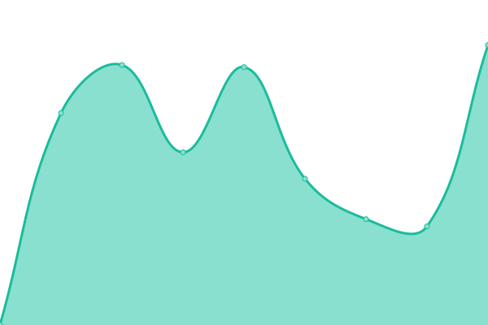

# [📈 Live Status](https://status.chengxiaobai.com): <!--live status--> **🟩 All systems operational**

This repository contains the open-source uptime monitor and status page for [mrgeneralgoo](https://www.chengxiaobai.com/), powered by [Upptime](https://github.com/upptime/upptime).

With [Upptime](https://upptime.js.org), you can get your own unlimited and free uptime monitor and status page, powered entirely by a GitHub repository. We use [Issues](https://github.com/mrgeneralgoo/status-page/issues) as incident reports, [Actions](https://github.com/mrgeneralgoo/status-page/actions) as uptime monitors, and [Pages](https://status.chengxiaobai.com) for the status page.

<!--start: status pages-->
<!-- This summary is generated by Upptime (https://github.com/upptime/upptime) -->
<!-- Do not edit this manually, your changes will be overwritten -->
<!-- prettier-ignore -->
| URL | Status | History | Response Time | Uptime |
| --- | ------ | ------- | ------------- | ------ |
|  [Blog](https://www.chengxiaobai.com) | 🟩 Up | [blog.yml](https://github.com/mrgeneralgoo/status-page/commits/HEAD/history/blog.yml) | 

 166ms
     
 | 

<a href="https://status.chengxiaobai.com/history/blog">100.00%</a>
    

|  [Image](https://cdn.chengxiaobai.com) | 🟩 Up | [image.yml](https://github.com/mrgeneralgoo/status-page/commits/HEAD/history/image.yml) | 

 204ms
     
 | 

<a href="https://status.chengxiaobai.com/history/image">100.00%</a>
    

|  [Blog(Archived)](https://www.chengxiaobai.cn) | 🟩 Up | [blog-archived.yml](https://github.com/mrgeneralgoo/status-page/commits/HEAD/history/blog-archived.yml) | 

 340ms
     
 | 

<a href="https://status.chengxiaobai.com/history/blog-archived">100.00%</a>
    

|  Proxy-T | 🟩 Up | [proxy-t.yml](https://github.com/mrgeneralgoo/status-page/commits/HEAD/history/proxy-t.yml) | 

 232ms
     
 | 

<a href="https://status.chengxiaobai.com/history/proxy-t">97.18%</a>
    

|  Proxy-V | 🟩 Up | [proxy-v.yml](https://github.com/mrgeneralgoo/status-page/commits/HEAD/history/proxy-v.yml) | 

 287ms
     
 | 

<a href="https://status.chengxiaobai.com/history/proxy-v">97.41%</a>
    

|  RSS | 🟩 Up | [rss.yml](https://github.com/mrgeneralgoo/status-page/commits/HEAD/history/rss.yml) | 

 891ms
     
 | 

<a href="https://status.chengxiaobai.com/history/rss">57.71%</a>
    

<!--end: status pages-->

[**Visit our status website →**](https://status.chengxiaobai.com)

## 📄 License

- Powered by: [Upptime](https://github.com/upptime/upptime)
- Code: [MIT](./LICENSE) © [mrgeneralgoo](https://www.chengxiaobai.com/)
- Data in the `./history` directory: [Open Database License](https://opendatacommons.org/licenses/odbl/1-0/)
