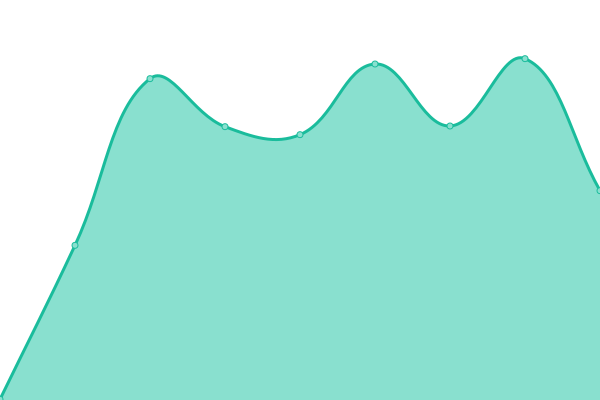

# [📈 Live Status](https://status.chengxiaobai.com): <!--live status--> **🟧 Partial outage**

This repository contains the open-source uptime monitor and status page for [mrgeneralgoo](https://www.chengxiaobai.com/), powered by [Upptime](https://github.com/upptime/upptime).

With [Upptime](https://upptime.js.org), you can get your own unlimited and free uptime monitor and status page, powered entirely by a GitHub repository. We use [Issues](https://github.com/mrgeneralgoo/status-page/issues) as incident reports, [Actions](https://github.com/mrgeneralgoo/status-page/actions) as uptime monitors, and [Pages](https://status.chengxiaobai.com) for the status page.

<!--start: status pages-->
<!-- This summary is generated by Upptime (https://github.com/upptime/upptime) -->
<!-- Do not edit this manually, your changes will be overwritten -->
<!-- prettier-ignore -->
| URL | Status | History | Response Time | Uptime |
| --- | ------ | ------- | ------------- | ------ |
|  Blog | 🟩 Up | [blog.yml](https://github.com/mrgeneralgoo/status-page/commits/HEAD/history/blog.yml) | 

 498ms
     
 | 

<a href="https://status.chengxiaobai.com/history/blog">100.00%</a>
    

|  CDN | 🟩 Up | [cdn.yml](https://github.com/mrgeneralgoo/status-page/commits/HEAD/history/cdn.yml) | 

 56ms
     
 | 

<a href="https://status.chengxiaobai.com/history/cdn">100.00%</a>
    

|  Proxy-Main | 🟩 Up | [proxy-main.yml](https://github.com/mrgeneralgoo/status-page/commits/HEAD/history/proxy-main.yml) | 

 432ms
     
 | 

<a href="https://status.chengxiaobai.com/history/proxy-main">100.00%</a>
    

|  Proxy-Backup | 🟥 Down | [proxy-backup.yml](https://github.com/mrgeneralgoo/status-page/commits/HEAD/history/proxy-backup.yml) | 

 400ms
     
 | 

<a href="https://status.chengxiaobai.com/history/proxy-backup">71.21%</a>
    

|  Proxy-Invisible | 🟩 Up | [proxy-invisible.yml](https://github.com/mrgeneralgoo/status-page/commits/HEAD/history/proxy-invisible.yml) | 

 469ms
     
 | 

<a href="https://status.chengxiaobai.com/history/proxy-invisible">100.00%</a>
    

|  RSS | 🟥 Down | [rss.yml](https://github.com/mrgeneralgoo/status-page/commits/HEAD/history/rss.yml) | 

 3087ms
     
 | 

<a href="https://status.chengxiaobai.com/history/rss">71.22%</a>
    

|  Blog(Archived) | 🟥 Down | [blog-archived.yml](https://github.com/mrgeneralgoo/status-page/commits/HEAD/history/blog-archived.yml) | 

 478ms
     
 | 

<a href="https://status.chengxiaobai.com/history/blog-archived">73.18%</a>
    

<!--end: status pages-->

[**Visit our status website →**](https://status.chengxiaobai.com)

## 📄 License

- Powered by: [Upptime](https://github.com/upptime/upptime)
- Code: [MIT](./LICENSE) © [mrgeneralgoo](https://www.chengxiaobai.com/)
- Data in the `./history` directory: [Open Database License](https://opendatacommons.org/licenses/odbl/1-0/)
